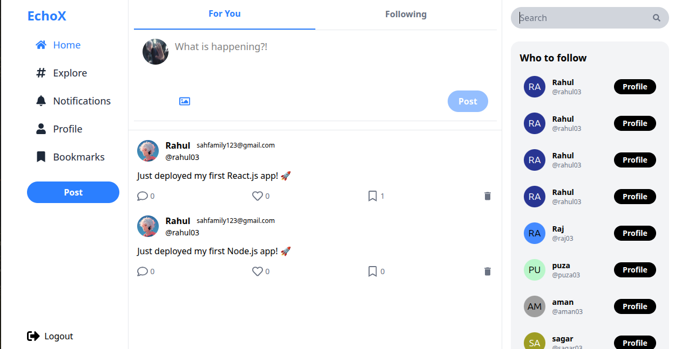

#  EchoX — MERN Stack 

A full-stack **EchoX social media app** built using **MongoDB, Express.js, React, and Node.js (MERN)**.  
EchoX lets users register, post tweets, follow others, like tweets, and view a personalized feed — just like X (formerly Twitter).

---

## 🚀 Features

### 👤 Authentication
- Register & Login using **JWT Authentication**
- Secure password hashing using **bcrypt**
- Protected routes with authentication **middleware**

---

### 🗨️ Tweets
- ✍️ Create new tweets (text + optional image)
- 🗑️ Delete your own tweets
- ❤️ Like and Unlike tweets
- 📰 View all tweets or tweets only from followed users

---

### 🤝 Follow System
- ➕ Follow and ➖ Unfollow users
- 👥 View followers and following lists
- 🧠 Dynamic UI updates on follow/unfollow actions

---

### 💾 Backend
- RESTful API built with **Express.js**
- **MongoDB** database using **Mongoose models**
- **JWT-based authentication**
- Robust error handling and validation

---

### 💻 Frontend
- Built with **React.js + Vite**
- State management with **Redux Toolkit**
- **Axios** for API calls
- Responsive UI with **Tailwind CSS**
- Toast notifications using **react-hot-toast**

---

## 🧩 Tech Stack

| Category | Technologies |
|-----------|--------------|
| **Frontend** | React, Redux Toolkit, Axios, React Router, Tailwind CSS |
| **Backend** | Node.js, Express.js |
| **Database** | MongoDB + Mongoose |
| **Authentication** | JWT, bcrypt |
| **Other Tools** |  dotenv, cors |

---

## 🧠 API Endpoints

### 🔐 Auth Routes

| Method | Endpoint | Description |
|---------|-----------|-------------|
| `POST` | `/api/v1/register` | Register a new user |
| `POST` | `/api/v1/login` | Login user |

---

### 👤 User Routes

| Method | Endpoint | Description |
|---------|-----------|-------------|
| `PUT` | `/api/v1/follow/:id` | Follow a user |
| `PUT` | `/api/v1/unfollow/:id` | Unfollow a user |
| `GET` | `/api/v1/users/:id` | Get user profile |

---

### 🗨️ Tweet Routes

| Method | Endpoint | Description |
|---------|-----------|-------------|
| `POST` | `/api/v1/tweet` | Create a new tweet |
| `DELETE` | `/api/v1/tweet/:id` | Delete a tweet |
| `PUT` | `/api/v1/tweet/:id/like` | Like / Unlike a tweet |
| `GET` | `/api/v1/tweets` | Get all tweets |

---

## 📸 Screenshots

## 🤝 Contributing

Pull requests are welcome! For major changes, please open an issue first to discuss what you’d like to change.

### 🧑‍💻 Author

**Rahul Sah | Full Stack Developer | MERN | TypeScript | DevOps**